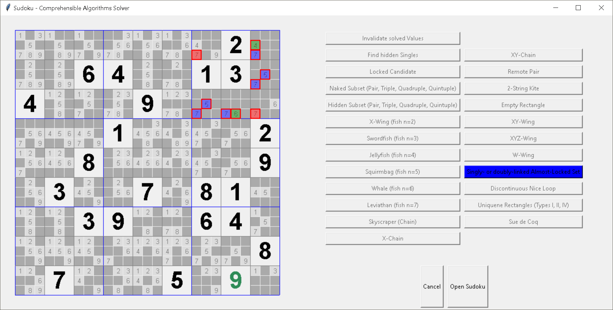

# Comprehensible Sudoku Solver

Comprehensible Sudoku Solver implements some standard strategies to solve difficult Sudoku puzzles:
- Locked Candidate
- Naked Subset (Pairs, Triples, Quadruples, Quintuples)
- Hidde Subset (Pairs, Triples, Quadruples, Quintuples)
- Fishes of different sizes (X-Wing, Swordfish, Jellyfish, Squirmbag, Whale, Leviathan)
- Skyscraper
- X-Chain
- XY-Chain
- Remote Pair
- 2-String Kite
- Empty Rectangle
- XY-Wing
- XYZ-Wing
- W-Wing
- Singly- or doubly-linked Almost-Locked Set
- Discontinuous Nice Loop
- Unique Rectangles (Types I, II, IV)
- Sue de Coq



The goal is to avoid backtracking (brute force) algorithms but only use humanly comprehensible strategies.

## Requirements

- Python 3.8+
- Tkinter (usually installed with Python on Win/Mac)
- pandas (for copy-to-clipboard function; not available in UI)

## Installation

Clone project. Use the package manager [pip](https://pypi.org/project/pip/) to install requirements.

```bash
pip install -r requirements.txt
```

## Usage

```bash
python main.py
```

Edit <code>./soduku_solver/puzzles/prefills.py</code> to alter the loaded Sudoku.

## License
[MIT](https://choosealicense.com/licenses/mit/)